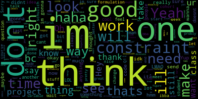

Steps to follow:

1. Follow the instructions [here](https://www.zapptales.com/en/download-facebook-messenger-chat-history-how-to/) to download the data from Facebook. 

2. Go to messages and then inbox folder.

3. Select the person you want to create the word cloud for, and copy "message_1.json" file.


```python
"""
This script is for creating a word cloud from the data file extracted from Facebook Messenger 

@author: Shahzeb Afroze
"""
```


```python
import json
from wordcloud import WordCloud

import matplotlib.pyplot as plt
% matplotlib inline
```


```python
with open("chat.json", "r") as read_file:
    data = json.load(read_file)
```


```python
# empty variabels for storing data
shahzeb_relationship = []
friend_relationship = []

# number of messages
size = len(data['messages'])

# Variable
me = 'Shahzeb Afroze'
friend = 'full name of friend'

for num in range(size):
    message = data['messages'][num]
    content = message.get('content','') # necessary because some chat only has images
    sender = message['sender_name']
    
    if sender == friend:
        friend_relationship.append(content)
    
    else:
        shahzeb_relationship.append(content)
    
```


```python
wordcloud = WordCloud()

seperator = ', '

shahzeb_text = seperator.join(shahzeb_relationship)
friend_text = seperator.join(friend_relationship)

gen_cloud_1 = wordcloud.generate(shahzeb_text)
gen_cloud_2 = wordcloud.generate(friend_text)

plt.imshow(gen_cloud_1, interpolation='bilinear')
plt.axis("off")
plt.show()

```





```python
# save the wordcloud image to folder
wordcloud.to_file('image.png')

```


